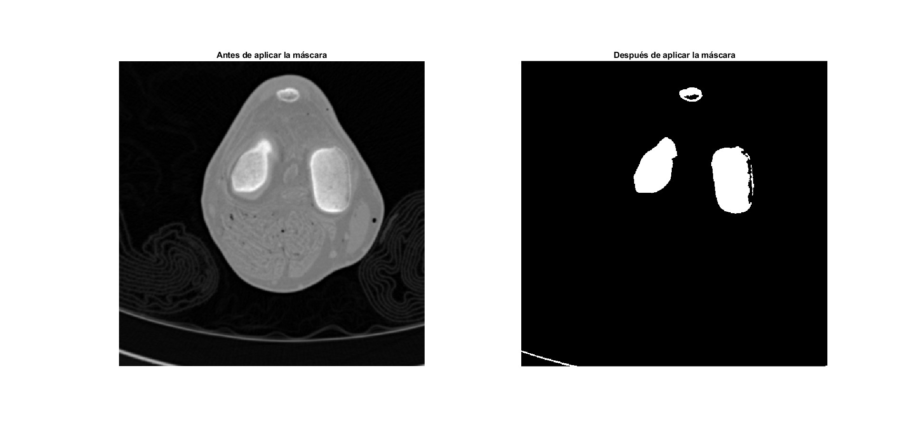
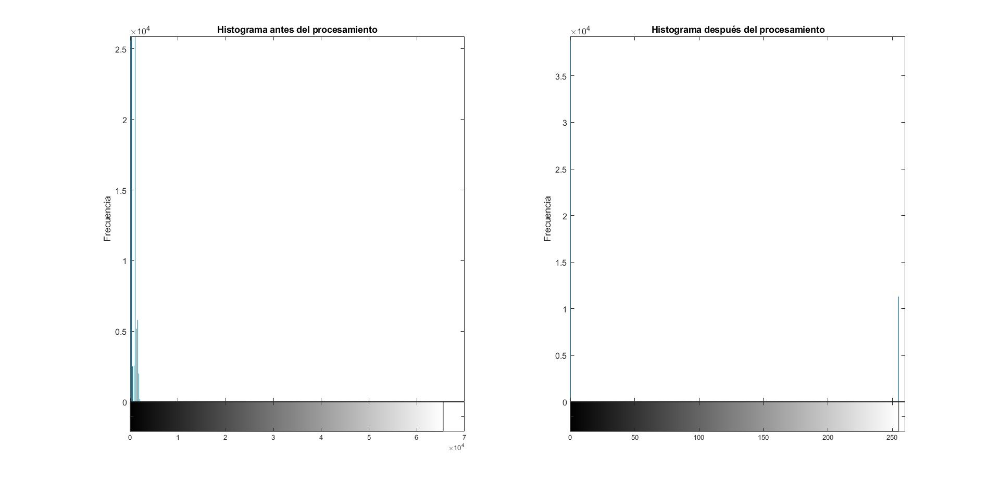
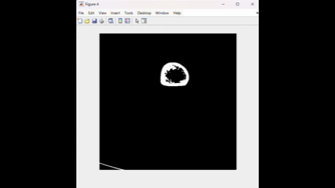

# 🦴 3D Knee Bone Tissue Segmentation from CT Scans

## 📝 Project Overview
This MATLAB project performs **automated segmentation of bone tissue** from knee CT scans using histogram thresholding techniques. It processes DICOM images to isolate bone structures, enhances visualization through custom opacity/color mapping, and generates interactive 3D reconstructions. The pipeline includes DICOM loading, intensity normalization, threshold-based segmentation, and volumetric rendering with affine transformations.

## ✨ Key Features
- 🖼️ DICOM volume loading and preprocessing
- ⚡ Automated bone segmentation via histogram thresholding
- 🎨 Custom transfer functions for density visualization
- 🔍 Affine transformations for spatial correction
- 🌀 Interactive 3D rendering with `volshow`
- 📊 Comparative histogram analysis
- 📁 Complete DICOM handling pipeline

## ⚙️ How It Works
  
*Figure 1: Complete processing workflow from DICOM loading to 3D reconstruction*

The system follows this computational workflow:
1. **DICOM Loading**: Reads series of `.dcm` files into 3D volume (512×512×N)
2. **Intensity Normalization**: Converts to [0,1] range with `mat2gray`
3. **Threshold Segmentation**: Isolates bone tissue using fixed threshold (0.445)
4. **Spatial Transformation**: Applies Z-axis scaling (2.5×) to correct aspect ratio
5. **Transfer Functions**: Maps densities to opacity/color via piecewise linear interpolation
6. **Volumetric Rendering**: Generates interactive 3D views using `volshow`

## 🎯 Purpose
Developed for orthopedic analysis and educational purposes, this tool enables:
- Non-invasive examination of knee bone structures
- Pre-surgical planning visualization
- Density distribution analysis of bone tissue
- Teaching resource for medical imaging courses

## 📊 Results

### Segmentation Process
| Stage | Visualization | Description |
|-------|---------------|-------------|
| Original |  | *Figure 2: Raw DICOM slice before processing* |
| Thresholded |  | *Figure 3: Binary mask after threshold application* |
| Histogram Comparison |  | *Figure 4: Intensity distribution changes after segmentation* |

### 3D Reconstructions
| Visualization | Rendering |
|---------------|-----------|
| Bone Mask |  *Figure 5: 3D reconstruction of segmented bone tissue* |
| Tissue Densities |  *Figure 6: Density-mapped visualization showing mineral variations* |
| Final Render |  *Figure 7: Clinical-grade reconstruction with optimized lighting* |

## 🔮 Potential Applications
- **Orthopedic Diagnostics**: Identify bone fractures and degeneration
- **Surgical Planning**: Virtual pre-operative simulations
- **Prosthesis Design**: Custom implant modeling
- **Research**: Bone density studies in osteoporosis
- **Education**: Interactive anatomy teaching tools
- **AR Integration**: Surgical navigation systems

## 📜 License
This project is licensed under the **Academic Research License** - developed at Tecnológico de Monterrey for educational and research purposes. Commercial use requires explicit permission. See [LICENSE](LICENSE) for details.

> **DICOM Dataset Note**: The knee CT dataset used in this project can be obtained following the instructions in [DU01_knee_06mm.md](DU01_knee_06mm.md). The dataset is for academic use only.
